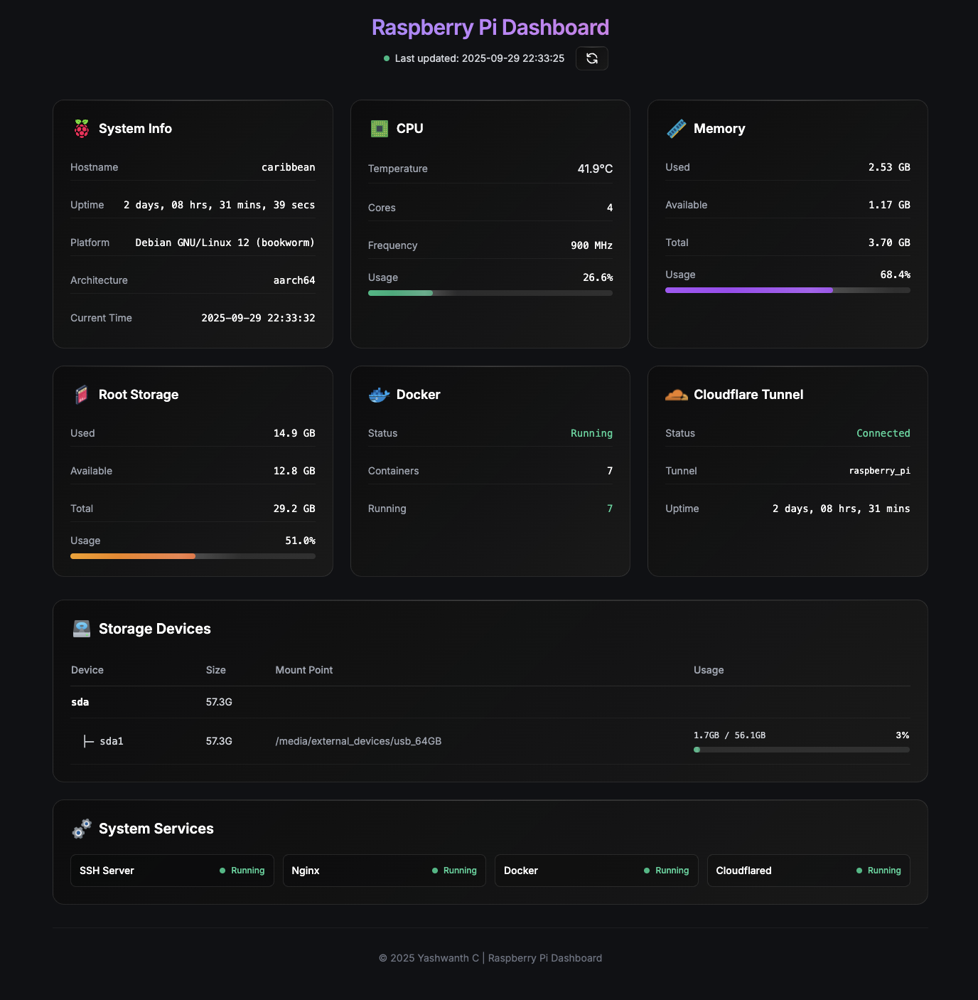

# Raspberry Pi Dashboard

A lightweight, real-time dashboard for monitoring Raspberry Pi system metrics and services. Built with a clean separation between frontend and backend, this dashboard provides essential system monitoring in an elegant web interface.

## 📸 Preview



*Real-time responsive dashboard showing system metrics, CPU temperature, memory usage, storage devices, Docker status, and service monitoring*

## 🎯 Features

### System Monitoring
- **CPU Metrics**: Temperature, usage percentage, core count, and frequency
- **Memory Usage**: Real-time RAM usage with visual indicators
- **Storage Information**: Detailed disk usage for all mounted devices
- **System Information**: Hostname, uptime, OS details, and architecture

### Service Monitoring
- **Docker**: Container status, running containers count, and error reporting
- **Cloudflared**: Tunnel connectivity status and uptime tracking
- **System Services**: Configurable monitoring of systemd services (SSH, nginx, etc.)
- **JSON Configuration**: Services to monitor are configured in `be/config/services.json` - no code changes needed to add new services

### User Experience
- **Real-time Updates**: Auto-refresh every 30 seconds
- **Responsive Design**: Works on desktop, tablet, and mobile devices
- **Visual Indicators**: Color-coded status indicators and progress bars
- **Glass Morphism UI**: Modern, elegant interface with smooth animations
- **Loading States**: Smooth loading experience with proper feedback

## 🛠 Tech Stack

### Backend
- **Python 3.x** with **Flask** framework
- **JSON Configuration** - Services monitoring configured via external JSON file
- **psutil** for system metrics collection
- **docker-py** for Docker integration
- **Flask-CORS** for cross-origin requests
- **subprocess** for system service monitoring

### Frontend
- **Vanilla HTML5/CSS3/JavaScript** (no framework dependencies)
- **Modular JavaScript** - Separated into external files for better maintainability
- **Tailwind CSS** via CDN for styling
- **Responsive design** with CSS Grid and Flexbox
- **ES6+ JavaScript** for modern browser features

## 📋 Prerequisites

- Raspberry Pi (tested on Pi 4B) running Raspberry Pi OS
- Python 3.7 or higher
- pip (Python package installer)
- Internet connection for Tailwind CSS CDN

## 🚀 Installation & Setup

### 1. Clone the Repository
```bash
git clone https://github.com/yourusername/RPi-dash.git
cd RPi-dash
```

### 2. Backend Setup
```bash
# Navigate to backend directory
cd be

# Create virtual environment (recommended)
python3 -m venv .venv
source .venv/bin/activate  # On Windows: .venv\Scripts\activate

# Install dependencies
pip install -r requirements.txt
```

### 3. Frontend Configuration
Edit the API endpoint in `fe/dashboard.js` (line 7):
```javascript
const API_BASE = 'http://YOUR_PI_IP:5555/api';
```
Replace `YOUR_PI_IP` with your Raspberry Pi's IP address.

## 🏃‍♂️ Running the Application

### Development Mode
```bash
cd be
source .venv/bin/activate  # If using virtual environment
python server.py
```

### Production Mode

#### Option 1: Gunicorn Daemon (Recommended)
```bash
cd be
source .venv/bin/activate
pip install -r requirements.txt  # Includes gunicorn
mkdir -p logs
gunicorn --config gunicorn.conf.py server:app
```
*Runs in background automatically with daemon mode enabled*

#### Option 2: As a System Service
```bash
# Copy service file to systemd
sudo cp be/rpi-dashboard.service /etc/systemd/system/

# Edit paths in service file to match your installation
sudo nano /etc/systemd/system/rpi-dashboard.service

# Enable and start the service
sudo systemctl daemon-reload
sudo systemctl enable rpi-dashboard
sudo systemctl start rpi-dashboard

# Check status
sudo systemctl status rpi-dashboard

```
This option will automatically run the server when PI reboots but `gunicorn` option does not.

#### Process Management (Daemon Mode)
```bash
# Check if running
ps aux | grep gunicorn

# Stop daemon
kill $(cat be/logs/gunicorn.pid)

# View logs
tail -f be/logs/access.log
tail -f be/logs/error.log
```

The API server will start on `http://0.0.0.0:5555`

### Access the Dashboard
1. Open `fe/dashboard.html` in any modern web browser
2. Or serve it via a web server:
   ```bash
   cd fe
   python3 -m http.server 8000
   ```
   Then navigate to `http://localhost:8000/dashboard.html`

## 📡 API Endpoints

| Endpoint | Description |
|----------|-------------|
| `/api/system` | Basic system information |
| `/api/cpu` | CPU usage, temperature, and specs |
| `/api/memory` | Memory usage statistics |
| `/api/disk` | Storage usage for all devices |
| `/api/docker` | Docker status and containers |
| `/api/cloudflared` | Cloudflared tunnel status |
| `/api/services` | System services status |
| `/api/all` | All data in a single request |
| `/api/health` | Health check endpoint |

## ⚙️ Configuration

### Adding New Services to Monitor

Edit `be/config/services.json` to add or modify services:
```json
{
  "services": [
    {
      "name": "ssh",
      "display_name": "SSH Server",
      "description": "Secure Shell daemon for remote access"
    },
    {
      "name": "your-new-service",
      "display_name": "Your Service",
      "description": "Description of your service"
    }
  ]
}
```

Any systemd service can be monitored by adding a new service object to this JSON file. The application will automatically reload the configuration and display the new service in the dashboard.

### Customizing the Dashboard

#### Frontend Styling
- Edit Tailwind classes in `fe/dashboard.html`
- Modify the color scheme in the CSS variables
- Adjust refresh intervals in `fe/dashboard.js` (line 310: `setInterval(updateDashboard, 30000)`)

#### Frontend Logic
- All JavaScript functionality is in `fe/dashboard.js`
- Modular functions for easy customization of individual dashboard sections
- API configuration at the top of the file for easy endpoint changes

#### Backend Configuration
- **Services**: Configure monitored services in `be/config/services.json`
- **Server Port**: Change server port in `be/server.py` (line 383: `port=5555`)
- **Host Binding**: Modify host binding (default: `0.0.0.0` for all interfaces)
- **Custom Metrics**: Add custom metrics endpoints as needed
- **Fallback**: If config file is missing or invalid, uses built-in default services list

## 🔧 Troubleshooting

### Common Issues

1. **CPU Temperature not showing**
   - Ensure `/sys/class/thermal/thermal_zone0/temp` exists
   - Check file permissions

2. **Docker status shows "Error"**
   - Verify Docker is installed and running
   - Check user permissions for Docker socket

3. **Services showing "Unknown"**
   - Verify service names match systemd service files
   - Check systemctl permissions

4. **API connection failed**
   - Verify the API_BASE URL in `fe/dashboard.js`
   - Check firewall settings
   - Ensure backend server is running

### Debugging

Enable debug mode in Flask:
```python
app.run(host='0.0.0.0', port=5555, debug=True)
```

Check logs for detailed error information.

## 🗺 Future Plans

- [ ] **React Migration**: Frontend will be rewritten in React for better component management
- [ ] **Authentication**: Add login system for secure access
- [ ] **Historical Data**: Store and display metrics over time
- [ ] **Alerts**: Email/notification system for critical thresholds
- [ ] **Plugin System**: Extensible architecture for custom monitoring modules
- [ ] **Multi-Device Support**: Monitor multiple Raspberry Pi devices from one dashboard

## 🤝 Contributing

1. Fork the repository
2. Create a feature branch: `git checkout -b feature-name`
3. Make your changes and test them
4. Commit your changes: `git commit -m 'Add feature-name'`
5. Push to the branch: `git push origin feature-name`
6. Submit a pull request

### Development Guidelines
- Follow PEP 8 for Python code
- Use meaningful commit messages
- Test on actual Raspberry Pi hardware when possible
- Update documentation for new features

## 📄 License

This project is licensed under the MIT License - see the [LICENSE](LICENSE) file for details.

## 👨‍💻 Author

**Yashwanth C**

- GitHub: [@Yashu183](https://github.com/yashu183)
- Email: cyashu2000@gmail.com

## 🙏 Acknowledgments

- Built for the Raspberry Pi community
- Inspired by various system monitoring tools
- Thanks to contributors and users providing feedback

---

*Last updated: January 2025*